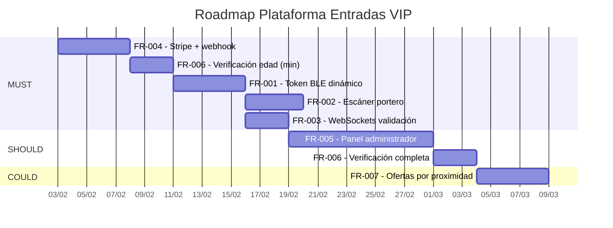

## 1. Resumen ejecutivo

La plataforma de venta de entradas y accesos VIP integra pagos digitales, tokens Bluetooth dinámicos y validación en tiempo real para automatizar el control de acceso en eventos y locales de ocio nocturno. El sistema se compone de una aplicación de usuario (emisión BLE), una aplicación de portero (escaneo y validación) y un backend que orquesta pagos, notificaciones y gestión de aforo mediante WebSockets.

El alcance obligatorio (MUST) cubre el ciclo core: compra de entrada con Stripe (FR‑004), generación y emisión del token BLE basado en TOTP (FR‑001), escaneo de proximidad del portero (FR‑002) y notificación en tiempo real con actualización de aforo (FR‑003). Los bloques SHOULD incluyen el panel de administración (FR‑005) y la verificación de edad (FR‑006), mientras que el motor de ofertas por proximidad (FR‑007) queda en el bucket COULD.

Los tres riesgos principales detectados son: (1) dependencia estructural – FR‑001 (MUST) requiere age_verified, pero FR‑006 es SHOULD, lo que podría bloquear el flujo básico si no se prioriza; (2) fiabilidad del BLE en segundo plano entre sistemas operativos; (3) escalado de la capa WebSocket para mantener latencias <200 ms bajo carga de eventos masivos.

## 2. Contexto y alcance

**Incluye:**
- Compra de entradas (normal/VIP) íntegramente online mediante Stripe.
- Emisión de token BLE dinámico (TOTP) vinculado a la entrada, activado por geofence.
- Validación del portero por proximidad (RSSI) y confirmación inmediata vía WebSocket.
- Panel de administración con creación de eventos, zonas VIP, asignación de beacons y dashboard de aforo.
- Verificación de edad (KYC) para cumplir restricciones +21.
- Notificaciones push de ofertas personalizadas por detección de beacons (bajo consentimiento).

**Explícitamente fuera (WON’T):**
- Integración con pasarelas de pago alternativas (PayPal, Bizum, efectivo).
- Soporte completo offline para validación sin conectividad de red.
- Módulo de taquilla física o punto de venta presencial.
- Gestión de eventos recurrentes o multi‑sesión en versión inicial.
- Internacionalización (i18n) y multi‑idioma.
- Exportación avanzada de informes financieros o integraciones ERP.
- Emisión de entradas en formato PDF/QR (sin BLE).

## 3. Arquitectura de datos inferida

```mermaid
classDiagram
    class Usuario {
        +id: UUID
        +nombre: string
        +email: string
        +age_verified: boolean
        +notificaciones_optin: boolean
    }
    class Evento {
        +id: UUID
        +nombre: string
        +fecha: datetime
        +aforo_max: integer
        +restriccion_edad: boolean
    }
    class Entrada {
        +id: UUID
        +usuario_id: UUID
        +evento_id: UUID
        +tipo: enum\{NORMAL,VIP\}
        +estado: string
        +token_id: UUID
    }
    class Pago {
        +id: UUID
        +stripe_pi_id: string
        +importe: decimal
        +estado: string
        +entrada_id: UUID
    }
    class TokenBLE {
        +id: UUID
        +entrada_id: UUID
        +secret_totp: string
        +ultimo_giro: datetime
        +activo: boolean
    }
    class ZonaVIP {
        +id: UUID
        +evento_id: UUID
        +nombre: string
        +capacidad: integer
        +precio_base: decimal
    }
    class Beacon {
        +id: UUID
        +evento_id: UUID
        +beacon_id: string
        +ubicacion: string
    }
    class Oferta {
        +id: UUID
        +usuario_id: UUID
        +beacon_id: UUID
        +mensaje: string
        +enviada_en: datetime
    }
    class Validacion {
        +id: UUID
        +entrada_id: UUID
        +portero_id: UUID
        +timestamp: datetime
        +puerta_id: string
    }
    class EscanerPortero {
        +id: UUID
        +portero_id: UUID
        +evento_id: UUID
        +dispositivo_id: string
    }

    <<FR-006>> Usuario
    <<FR-005>> Evento
    <<FR-001, FR-004>> Entrada
    <<FR-004>> Pago
    <<FR-001>> TokenBLE
    <<FR-005>> ZonaVIP
    <<FR-005, FR-007>> Beacon
    <<FR-007>> Oferta
    <<FR-002, FR-003>> Validacion
    <<FR-002>> EscanerPortero

    Usuario "1" -- "*" Entrada : adquiere
    Usuario "1" -- "*" Oferta : recibe
    Evento "1" -- "*" Entrada : contiene
    Evento "1" -- "*" ZonaVIP : define
    Evento "1" -- "*" Beacon : asigna
    Entrada "1" -- "1" TokenBLE : posee
    Entrada "1" -- "1" Pago : pagada_con
    Entrada "1" -- "*" Validacion : registra
    Beacon "1" -- "*" Oferta : dispara
    EscanerPortero "1" -- "*" Validacion : realiza
```

## 4. Matriz de requirements (MoSCoW)

### MUST
| Código | Título | Tipo | Estado | R | A | Diagramas |
|--------|--------|------|--------|----|----|-----------|
| FR-001 | Emisión de token BLE dinámico (TOTP) | functional | Propuesto | Equipo de desarrollo móvil | CTO | — |
| FR-002 | Escáner BLE del portero con filtrado RSSI | functional | Propuesto | Equipo de desarrollo móvil | Product Owner | — |
| FR-003 | Validación en tiempo real vía WebSockets | functional | Propuesto | Backend Team | CTO | — |
| FR-004 | Procesamiento de pagos con Stripe | functional | Propuesto | Backend Team | CTO | — |

### SHOULD
| Código | Título | Tipo | Estado | R | A | Diagramas |
|--------|--------|------|--------|----|----|-----------|
| FR-005 | Panel de administración del local | functional | Propuesto | Frontend Team | Product Owner | — |
| FR-006 | Verificación de edad (KYC) | functional | Propuesto | Equipo de desarrollo móvil | Oficial de cumplimiento | — |

### COULD
| Código | Título | Tipo | Estado | R | A | Diagramas |
|--------|--------|------|--------|----|----|-----------|
| FR-007 | Motor de proximidad para ofertas push | functional | Propuesto | Backend Team | Product Owner | — |

### WON’T
| Código | Título | Tipo | Estado | R | A | Diagramas |
|--------|--------|------|--------|----|----|-----------|
| WONT-001 | Soporte para pagos con PayPal/Bizum | functional | Fuera de alcance | — | — | — |
| WONT-002 | App de taquilla física | functional | Fuera de alcance | — | — | — |
| WONT-003 | Modo 100% offline para validación | functional | Fuera de alcance | — | — | — |
| WONT-004 | Internacionalización inicial | functional | Fuera de alcance | — | — | — |

## 5. Flujo de dependencias

```mermaid
flowchart TD
    FR_004["FR-004: Stripe Payment"]
    FR_006["FR-006: Verificación edad"]
    FR_001["FR-001: Token BLE dinámico"]
    FR_002["FR-002: Escáner portero"]
    FR_003["FR-003: Validación WebSocket"]
    FR_005["FR-005: Panel admin"]
    FR_007["FR-007: Ofertas proximidad"]

    FR_004 --> FR_001 : genera entrada y token
    FR_006 --> FR_001 : habilita emisión BLE
    FR_001 --> FR_002 : expone token a escanear
    FR_002 --> FR_003 : envía validación confirmada
    FR_003 --> FR_005 : actualiza aforo en dashboard
    FR_004 --> FR_005 : alimenta datos de ventas
    FR_005 --> FR_007 : asigna beacons publicitarios
```

*Nota:* No se incluyen nodos BPMN al no haber diagramas de proceso enlazados en la especificación.

## 6. Matriz RACI consolidada

| Actor | Responsible (R) | Accountable (A) | Consulted (C) | Informed (I) |
|-------|-----------------|-----------------|---------------|--------------|
| Equipo de desarrollo móvil | FR-001, FR-002, FR-006 | — | — | — |
| CTO | — | FR-001, FR-003, FR-004 | — | — |
| Product Owner | — | FR-002, FR-005, FR-007 | FR-006 | FR-001 |
| Arquitecto de seguridad | — | — | FR-001, FR-004 | — |
| Desarrollador Backend | — | — | FR-001 | — |
| Arquitecto BLE | — | — | FR-002 | — |
| Diseñador UX | — | — | FR-002, FR-005 | — |
| Dueño del local | — | — | FR-005, FR-007 | FR-002, FR-006 |
| Backend Team | FR-003, FR-004, FR-007 | — | — | — |
| Arquitecto de infraestructura | — | — | FR-003 | — |
| DevOps | — | — | FR-003 | — |
| Equipo de soporte | — | — | — | FR-003 |
| Equipo de finanzas | — | — | FR-004 | — |
| Frontend Team | FR-005 | — | — | — |
| Oficial de cumplimiento | — | FR-006 | — | — |
| Asesor legal | — | — | FR-006 | — |
| Equipo de marketing | — | — | FR-005, FR-007 | FR-005 |
| Cliente | — | — | — | FR-004, FR-007 |

## 7. Riesgos y mitigaciones

| ID | Descripción | Probabilidad | Impacto | Mitigación | Owner |
|----|-------------|--------------|---------|------------|-------|
| R-01 | FR‑001 (MUST) depende de age_verified, pero FR‑006 es SHOULD, bloqueando el flujo básico de acceso. | Alta | Crítico | Incluir un mecanismo mínimo de verificación (autodeclaración) en el Sprint de MUST, con KYC completo posterior. | CTO / Product Owner |
| R-02 | Emisión BLE en segundo plano no fiable en todos los modelos Android/iOS. | Media | Alto | Pruebas exhaustivas con escaneo de foreground service; habilitar opción de vibración/permanencia de app como plan B. | Equipo de desarrollo móvil |
| R-03 | Cuellos de botella en WebSockets durante picos de validación (entrada masiva). | Media | Alto | Arquitectura de auto‑escalado horizontal del servidor Socket.io; limitación de conexiones por portero. | Backend Team / DevOps |
| R-04 | Idempotencia del webhook de Stripe mal implementada que genere duplicados. | Baja | Muy alto | Verificar idempotencia con stripe_pi_id en base de datos; pruebas con reintentos de Stripe CLI. | Backend Team |
| R-05 | Manipulación del importe en el cliente antes de crear PaymentIntent. | Baja | Crítico | Cálculo del importe íntegramente en el servidor; el endpoint solo acepta item_id y cantidad. | Backend Team / Arquitecto de seguridad |

## 8. Roadmap sugerido

Se asume una duración de 1 día = 1 jornada laboral completa (8h), con solapes mínimos para equipos paralelizables.



**Nota sobre FR-006:** Se incluye una implementación básica (autodeclaración) dentro de MUST para satisfacer la dependencia crítica de FR‑001. La verificación completa (documental) se ubica en SHOULD.

## 9. Glosario y referencias

| Término | Definición |
|---------|-------------|
| BLE | Bluetooth Low Energy, tecnología de comunicación inalámbrica de corto alcance y bajo consumo. |
| TOTP | Time-based One-Time Password (RFC 6238): contraseña de un solo uso basada en el tiempo. |
| RSSI | Received Signal Strength Indicator; valor que estima la distancia entre emisor y receptor BLE. |
| WebSocket | Protocolo de comunicación bidireccional en tiempo real sobre TCP. |
| Socket.io | Librería JavaScript que abstrae WebSocket y proporciona reconexión automática. |
| PaymentIntent | Objeto de Stripe que representa el ciclo de vida de un pago, desde la creación hasta la confirmación. |
| Geofence | Perímetro virtual definido por coordenadas que dispara acciones al entrar/salir un dispositivo. |
| KYC | Know Your Customer; proceso de verificación de identidad del usuario. |

**Referencias a estándares y normativas:**
- Bluetooth SIG – Especificaciones BLE 5.x.
- RFC 6238 – TOTP: Time-Based One-Time Password Algorithm.
- PCI DSS – Requisitos de seguridad para el manejo de datos de tarjetas de crédito (Stripe cumple nivel 1).
- GDPR – Reglamento General de Protección de Datos (UE) 2016/679 para el tratamiento de datos personales.
- ISO 27001 – Marco de gestión de seguridad de la información aplicable al backend y almacenamiento.